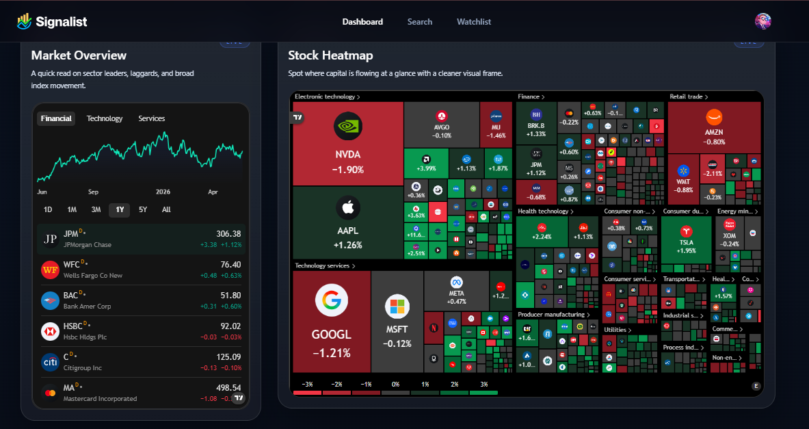
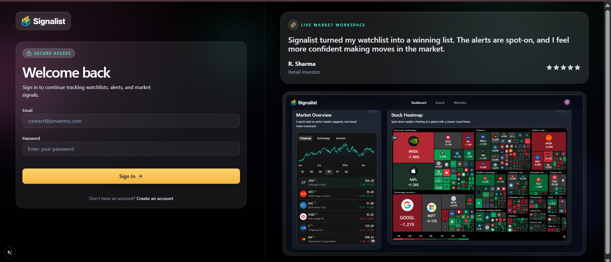
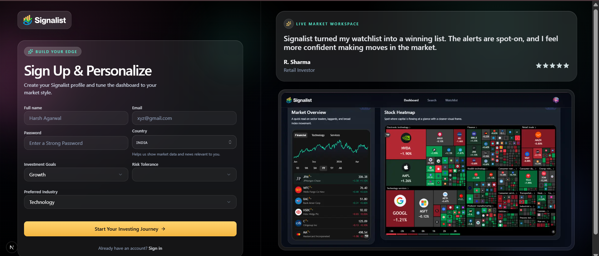
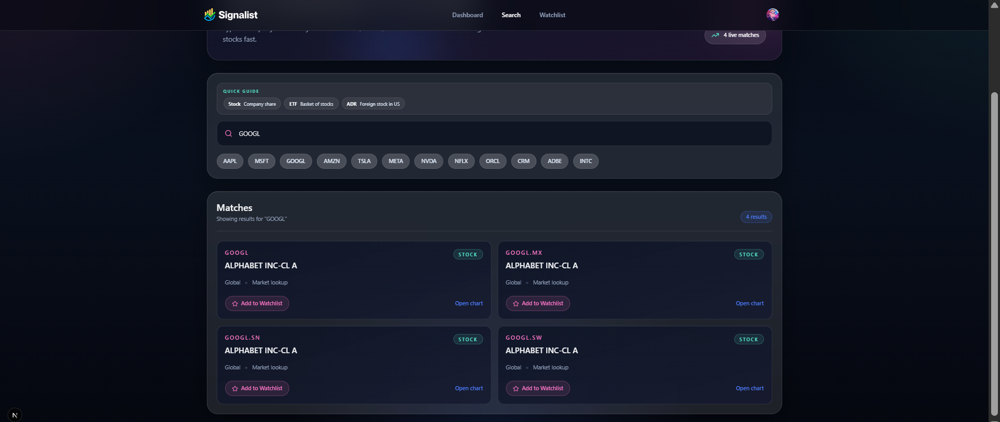
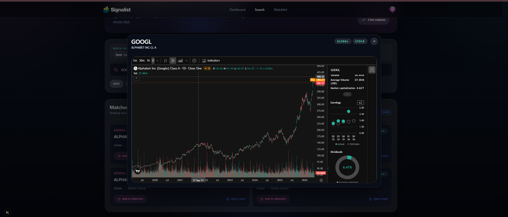
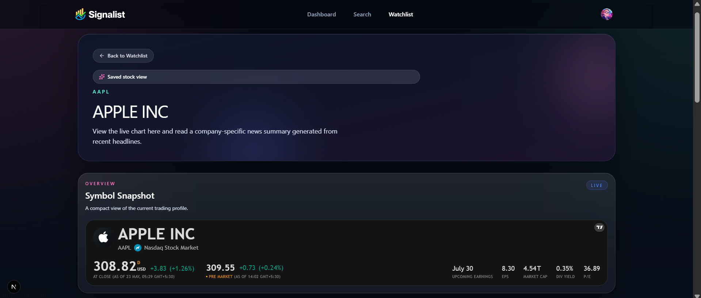
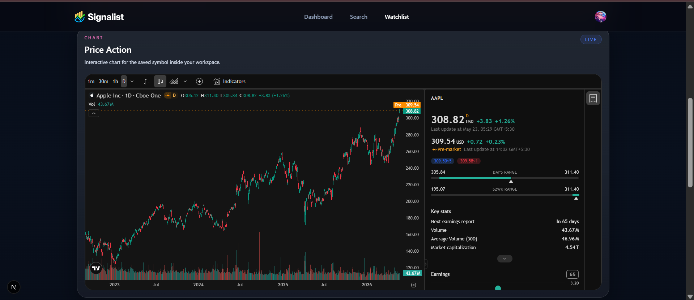
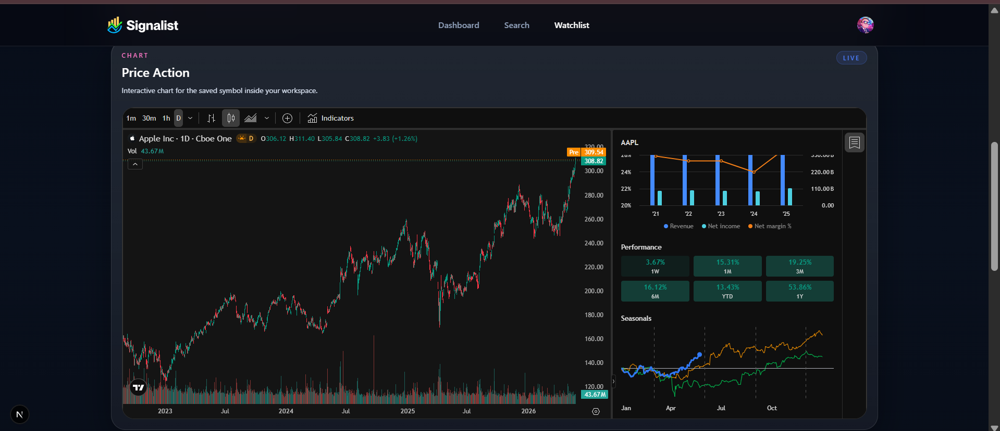
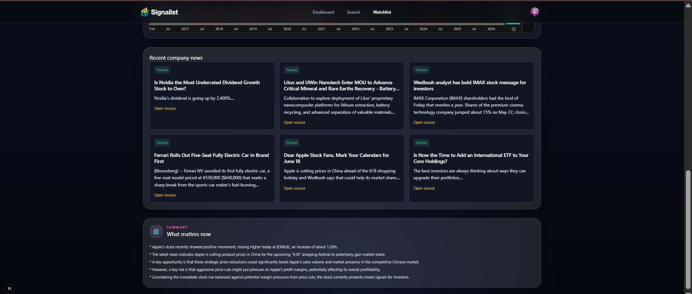

# 🚀 Signalist: Your Market Command Center

Signalist is a modern, AI-powered stock market dashboard designed for quick decisions and a cleaner view of the market. It integrates real-time data, interactive technical charts, and AI-driven insights to provide a comprehensive trading environment.



## ✨ Features

### 📊 Real-time Market Dashboard
- **Market Pulse**: Track broad momentum and sector rotation with live TradingView widgets.
- **Global Heatmap**: Spot where capital is flowing across sectors at a glance.
- **Top Stories**: Keep the latest market narrative right beside price action.
- **Market Data Snapshots**: Scan relevant names in a dense, easy-to-read layout.

### 🌟 Personalized Watchlist
- **Curated Tracking**: Build and manage your personal stock watchlist.
- **Dynamic Charting**: Seamlessly switch between watchlist items and view deep-dive technical charts.
- **Detailed Snapshots**: View company-specific news, quotes, and AI-generated summaries for your tracked symbols.

### 🤖 AI-Powered Insights
- **Smart Onboarding**: Personalized welcome emails based on your investment goals and risk tolerance, generated via Google Gemini.
- **Daily Market Summary**: Scheduled Inngest workflows that summarize the most relevant news for your watchlist stocks using AI.
- **Company Deep-dives**: AI-generated bullet points summarizing opportunities and risks for specific stocks.

### 🔒 Secure & Modern Auth
- Powered by **Better Auth** for secure, seamless sign-in and profile management.
- Personalized user profiles capturing country, industry preferences, and investment styles.

## 🛠️ Tech Stack

- **Frontend**: [Next.js 15+](https://nextjs.org/), TypeScript, [Tailwind CSS 4](https://tailwindcss.com/)
- **UI Components**: [Shadcn UI](https://ui.shadcn.com/), [Radix UI](https://www.radix-ui.com/), [Lucide React](https://lucide.dev/)
- **Backend**: Next.js Server Actions, [Inngest](https://www.inngest.com/) (Workflows & AI Orchestration)
- **Database**: [MongoDB](https://www.mongodb.com/) with [Mongoose](https://mongoosejs.com/)
- **Authentication**: [Better Auth](https://better-auth.com/)
- **AI Engine**: [Google Gemini 2.5 Flash](https://deepmind.google/technologies/gemini/)
- **Data APIs**: [Finnhub API](https://finnhub.io/) (Market Data), [TradingView](https://www.tradingview.com/) (Widgets & Charts)
- **Email**: [Nodemailer](https://nodemailer.com/)

## 📸 Visual Tour

| Feature                          | Preview                                                              |
|:---------------------------------|:---------------------------------------------------------------------|
| **Sign-In Page**                 |                |
| **Sign-Up Page**                 |               |
| **Main Dashboard**               |  |
| **Stock Search & Discovery**     |         |
| **Candle Chart At Search**       |                    |
| **Personalised Watchlist**       |                   |
| **Interactive Technical Charts** |              |
| **Chart in Watchlist**           |                       |
| **Gemini News Summaries**        |                  |


## 🚀 Getting Started

### Prerequisites
- Node.js 20+ 
- MongoDB Instance (Local or Atlas)
- Finnhub API Key
- Google Gemini API Key
- Inngest Account (for workflows)

### Installation

1. **Clone the repository**
   ```bash
   git clone https://github.com/yourusername/stocks-app.git
   cd stocks-app
   ```

2. **Install dependencies**
   ```bash
   npm install
   ```

3. **Environment Setup**
   Create a `.env.local` file in the root directory and add the following:
   ```env
   # Database
   MONGODB_URL=your_mongodb_url

   # Auth
   BETTER_AUTH_SECRET=your_secret
   BETTER_AUTH_URL=http://localhost:3000

   # APIs
   NEXT_PUBLIC_FINNHUB_API_KEY=your_finnhub_key
   GEMINI_API_KEY=your_gemini_key

   # Inngest
   INNGEST_SIGNING_KEY=your_signing_key
   INNGEST_EVENT_KEY=your_event_key

   # Email (SMTP)
   EMAIL_SERVER_HOST=your_smtp_host
   EMAIL_SERVER_PORT=your_smtp_port
   EMAIL_SERVER_USER=your_email
   EMAIL_SERVER_PASSWORD=your_password
   EMAIL_FROM=noreply@signalist.com
   ```

4. **Run the development server**
   ```bash
   npm run dev
   ```

5. **Start Inngest Dev Server**
   ```bash
   npx inngest-cli@latest dev
   ```

## 📂 Project Structure

- `/app`: Next.js App Router (Auth groups, Root pages, API routes).
- `/components`: Reusable UI components and specialized TradingView widgets.
- `/lib/actions`: Server actions for database and API operations.
- `/lib/inngest`: Workflow definitions and AI prompt templates.
- `/database`: Mongoose models and connection logic.
- `/hooks`: Custom React hooks (e.g., TradingView integration).


